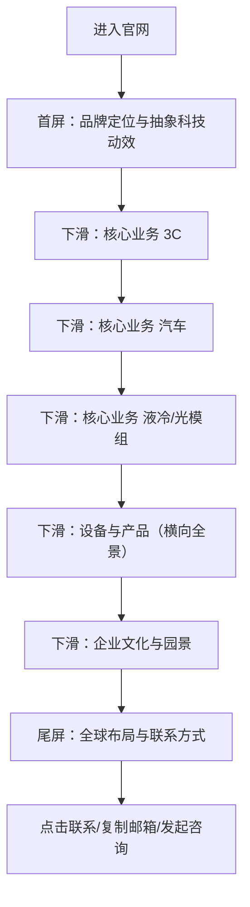

## 1. 产品概述
“华茂电子集团”官方网站（B2B集团官网），以浅色科技风与滚动叙事为核心，通过克制的高级感与电影化动效，强化“精密制造与前沿科技”的品牌心智。
- 目标用户：海外/国内B2B客户、合作伙伴、潜在人才、媒体与政府访客
- 核心价值：快速建立信任（实力与规模）、清晰传达业务能力、强化国际化科技品牌形象并提升转化（咨询/合作联系）

## 2. 核心功能

### 2.1 功能模块
1. **首页（滚动叙事单页）**：首屏品牌定位、核心业务三板块、设备与产品展示、企业文化与园景、全球布局与联系方式
2. **全站交互与动效系统**：全站平滑滚动、视差、滚动渐现（淡入/上移/轻微放大）、横向滑动/全景展示、全局导航与锚点定位

### 2.2 页面详情
| 页面名称 | 模块名称 | 功能描述 |
|---|---|---|
| 首页 | 顶部导航 | 极简顶部导航（Logo、锚点、语言切换入口占位、联系按钮），随滚动切换透明度与毛玻璃强度 |
| 首页 | 首屏Hero | 大字标题+副标题+关键标签；背景为抽象微观电路/液冷流体的3D氛围动效（浅色、银灰、科技蓝点缀） |
| 首页 | 核心业务·3C | 叙事段落：精密与微小；配3D产品渲染氛围图；要点列表（工艺/良率/一致性等） |
| 首页 | 核心业务·汽车 | 叙事段落：安全与智造；配3D产品渲染氛围图；要点列表（车规/可靠性/追溯等） |
| 首页 | 核心业务·液冷/光模组 | 叙事段落：散热与光速传输；配3D产品渲染氛围图；要点列表（热设计/光学/系统集成等） |
| 首页 | 设备与产品 | 网格+全景横向滑动（拖拽/滚轮/触控）；卡片呈现设备名、能力点；金属质感、精密线条与微弱反射 |
| 首页 | 企业文化与园景 | 色调轻微转暖；园区、团队、文化主张；强调“硬核科技 + 人文温度” |
| 首页 | 尾屏全球布局 | 世界地图点缀发光节点；国际化布局文案；底部简洁联系方式（地址/电话/邮箱/二维码占位） |
| 全局 | 动效与滚动 | 平滑滚动开启；滚动触发渐现（节奏统一）、视差背景、局部hover微动效；支持“减少动态效果”无障碍偏好 |

## 3. 核心流程
用户以滚动方式完成叙事路径：建立第一印象 → 理解三大业务 → 感知设备实力 → 感受文化温度 → 获得全球布局与联系方式并发起咨询。

## 4. 用户界面设计
### 4.1 设计风格
- 主色：纯净白（背景）+银灰（结构）+雾面玻璃（面板）
- 点缀色：科技蓝、极光青（用于高亮、节点、关键数据、交互态）
- 字体：品牌标题使用“高辨识度展示字体”，正文使用“高可读性无衬线”，中英混排保持一致气质
- 质感：大量留白、毛玻璃、微妙3D光影、精密线条/刻度/网格纹理、细腻噪点与柔和阴影
- 动效：电影化节奏（更少但更准），以滚动触发为主，配合视差与轻微镜头推进感

### 4.2 页面设计概览
| 页面名称 | 模块名称 | UI要素 |
|---|---|---|
| 首页 | Hero | 大字号标题、细线分割、标签胶囊、背景3D抽象（电路/流体）、轻微镜头推进、粒子/线条精密感 |
| 首页 | 核心业务 | 叙事分屏（图/文并列）、大图留白、渐现与视差、蓝/青点缀强调关键词 |
| 首页 | 设备与产品 | 精密网格布局+横向全景滑动、金属质感卡片、悬浮时高光与细线描边 |
| 首页 | 文化与园景 | 色温稍暖、照片/插画占位、团队与园区信息块、轻柔动效 |
| 首页 | 尾屏 | 全球地图+发光节点、极简底部信息、主要CTA（联系/下载资料占位） |

### 4.3 响应式
- 桌面优先：宽屏下强调留白与叙事节奏，信息密度克制
- 移动端适配：保留滚动叙事，横向全景改为可滑动轮播，触控手势优化
- 无障碍：支持键盘导航、对比度可读性、尊重“减少动态效果”系统偏好

### 4.4 3D 场景指导（用于抽象氛围与产品质感）
- 环境与氛围：浅色HDRI或拟HDR光照，强调银灰金属与玻璃折射的“洁净工业”质感
- 灯光：主光柔和、辅光冷色点缀；控制高光不过曝，保留细节层次
- 镜头：轻微推进/漂移；滚动时产生微小视差，避免眩晕
- 构图：微观电路线条与流体形态作为“技术隐喻”；焦点始终服务标题与叙事内容
- 后期：轻量Bloom、微噪点/颗粒、柔和暗角（克制使用）
