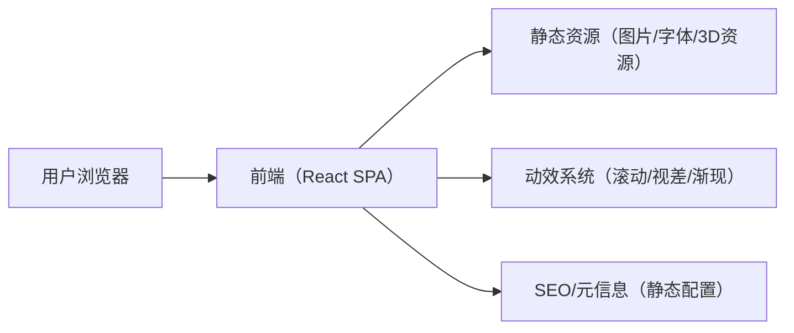

## 1. 架构设计

## 2. 技术选型说明
- 前端：React@18 + TypeScript + vite
- 样式：tailwindcss@3（配合CSS变量与自定义工具类实现品牌质感）
- 3D与背景氛围：three + @react-three/fiber + @react-three/drei（用于抽象电路/流体氛围与产品质感渲染占位）
- 后期效果（可选、轻量）：@react-three/postprocessing（Bloom/Noise等，严格控制性能）
- 动效：framer-motion（滚动触发渐现、交错节奏、微交互）
- 平滑滚动：Lenis（全站启用，统一滚动节奏；与滚动触发动效联动）
- 工程质量：eslint + prettier（保持一致性）

## 3. 路由定义
| 路由 | 目的 |
|---|---|
| / | 单页滚动叙事官网（含锚点定位与分区导航） |

## 4. API 定义
本项目为静态官网，无后端API。若后续需要“联系表单/资料下载/多语言CMS”，再引入后端或第三方服务。

## 5. 数据模型
以本地静态数据为主（JSON/TS常量），用于配置内容与可复用模块：
- 业务板块数据：标题、叙事文案、能力点、配图/3D场景配置
- 设备与产品数据：名称、参数要点、图片、标签
- 全球布局数据：节点坐标、地区名称、亮点描述

